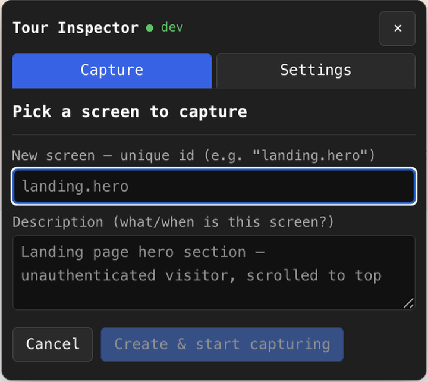
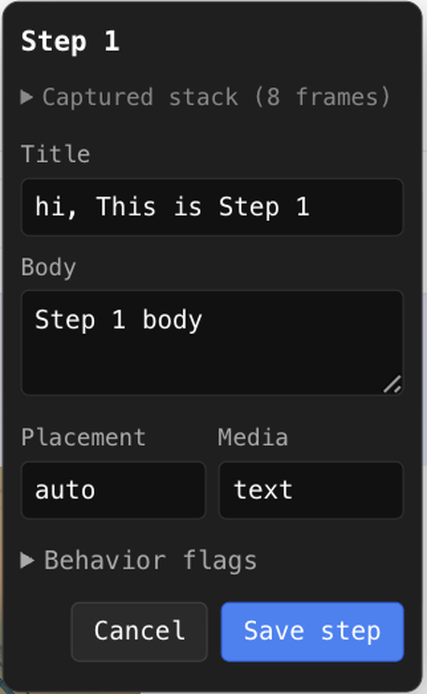
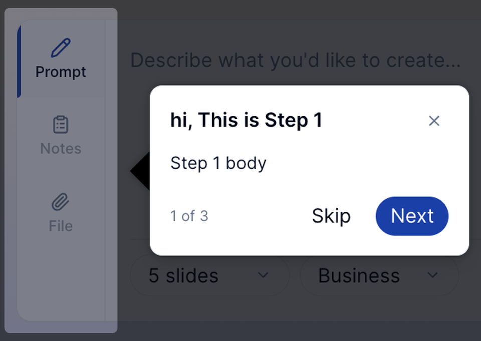
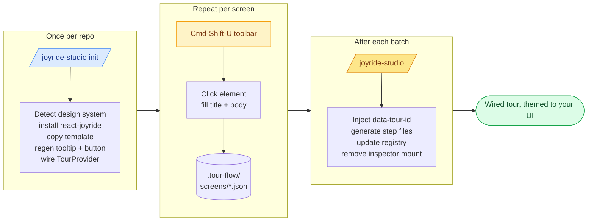
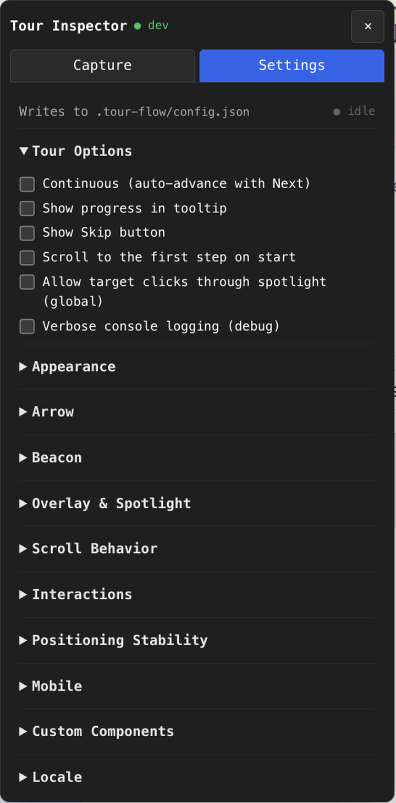
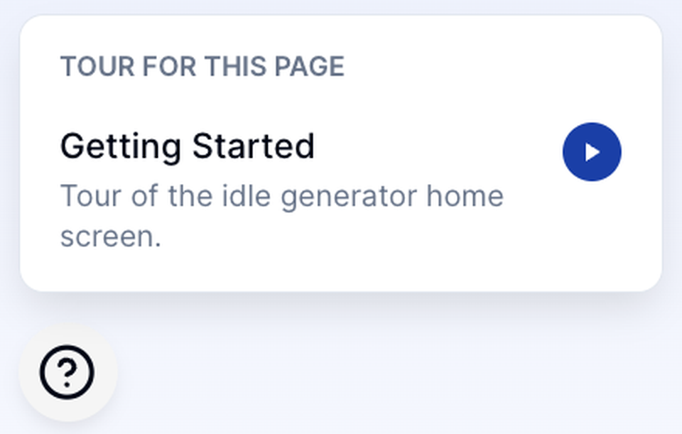
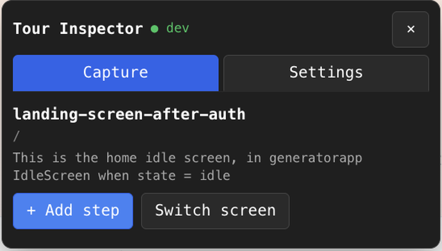
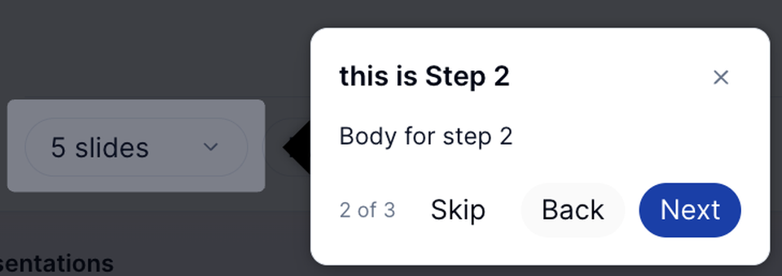
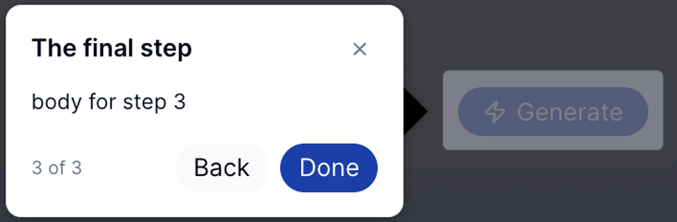
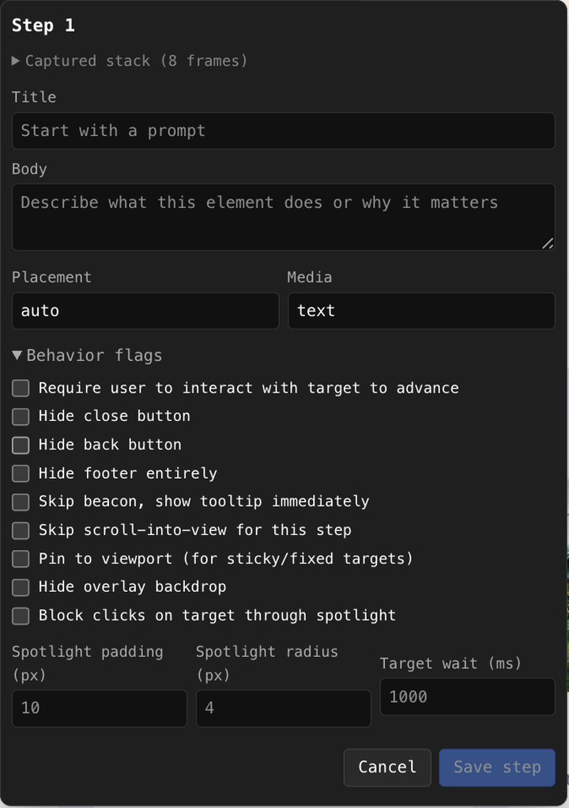

<div align="center">

# Joyride Studio

**Click. Capture. Ship.**

A visual authoring layer on top of [react-joyride](https://github.com/gilbarbara/react-joyride). Click the real elements in your running app — the skill writes the tour.

[](./LICENSE)
[](https://github.com/gilbarbara/react-joyride)
[](./CHANGELOG.md)
[](https://github.com/vercel-labs/skills)
[](./CONTRIBUTING.md)

[Install](#install) · [Why](#why-this-exists) · [How it works](#how-it-works) · [Settings](#settings-tab--full-joyride-control-plus-build-tour-extras) · [Contributing](#contributing) · [Roadmap](./ROADMAP.md)

</div>

> **A note on attribution.** This is a tooling layer. The runtime engine, the API, and most of the cleverness belong to [Gil Barbara and the react-joyride contributors](https://github.com/gilbarbara/react-joyride) — react-joyride is itself MIT-licensed open-source software, and Joyride Studio is an independent project, not affiliated with or endorsed by them. If you'd rather hand-write tours, use react-joyride directly. That's also a great answer.

---

## Install

```bash
npx skills add parakeet09/joyride-studio
```

That uses the [`skills` CLI](https://github.com/vercel-labs/skills) to drop the agent into your `.claude/skills/`. Restart Claude Code and `/joyride-studio init` becomes available as a slash command.

> **Project install:** lands in `./.claude/skills/joyride-studio/` (committable, shared with team).
> **Global install:** `npx skills add parakeet09/joyride-studio -g` lands in `~/.claude/skills/`.

---

## Why this exists

Hand-writing a Joyride tour means hunting for a stable CSS selector, eyeballing where the tooltip should sit, and crossing your fingers when the DOM shifts.

Joyride Studio replaces that loop with three actions:

<table>
  <tr>
    <td width="33%" align="center"></td>
    <td width="33%" align="center"></td>
    <td width="33%" align="center"></td>
  </tr>
  <tr>
    <td align="center"><sub><b>1.</b> Pick a screen, click an element</sub></td>
    <td align="center"><sub><b>2.</b> Fill in title + body</sub></td>
    <td align="center"><sub><b>3.</b> Run <code>/joyride-studio</code> — done</sub></td>
  </tr>
</table>

The skill takes care of everything else:

| You stop worrying about | Because Joyride Studio handles |
|---|---|
| Picking a stable CSS selector | Walks the React fiber, injects a `data-tour-id` into the real JSX |
| Tooltip looking out of place | Regenerates `TourTooltip` and `TourButton` using your repo's design tokens at `init` |
| Tooltip drifting from its target | Forwards `floatingOptions.autoUpdate` + an opt-in `MutationObserver` watcher |
| Tours looking broken on mobile | Viewport-aware overrides: larger beacon, modal placement, sticky-header offset |
| Wiring multiple tours per route | Built-in registry with `shouldShow` predicates + `useTourRefreshOnMount` |
| Replay trigger UI | Auto-mounted `?` button with a per-route menu, or roll your own via `useAvailableTours()` |

What Joyride Studio **doesn't** do: change anything about how react-joyride itself works at runtime. Every option react-joyride ships is reachable from the Settings panel; nothing is hidden.

---

## What's in the box

> Heads-up: GitHub auto-generates an outline for this README. Use the **outline** button in the top-right of GitHub's file viewer for full navigation — the hero links above cover the headline sections.

Running `/joyride-studio init` in any React + Vite repo installs and wires up:

| Piece | What it does |
|---|---|
| **Tour runtime** (`src/tour/`) | React provider, `?` replay button, custom Joyride tooltip themed to your repo's design system, route → tour registry |
| **Capture inspector** (`src/components/dev/`) | Floating dev toolbar (⌘⇧U) — click any element on screen to turn it into a tour step |
| **Vite dev plugin** (`vite-tour-plugin.ts`) | REST endpoints the inspector POSTs captures to; persists them as JSON |
| **Capture storage** (`.tour-flow/`) | Per-screen JSON files, committed to the repo, versionable |

None of it runs in production — the inspector is gated behind `import.meta.env.DEV && VITE_TOUR_AUTHORING === 'true'` and stripped by Vite's build.

---

## Who this is for

A developer on a **React + Vite** app who wants:

- ✓ Guided first-run tours for new users
- ✓ Tooltips that match the app's existing design system (not generic-looking)
- ✓ Multiple independent tours on different screens (and even different states of the same screen)
- ✓ A `?` button for returning users to replay the tour on demand
- ✓ Zero manual coordinate fiddling — click the real element in the running app, that becomes the tour anchor

Not yet supported in v1: **Next.js, CRA, webpack-only setups.**

---

## How it works



Under the hood: clicked elements are identified via React's internal `_debugStack` (React 19) or `_debugSource` (React 18) — that's how the toolbar can turn a click into a `fileName:lineNumber` pointing at the real JSX. The build step uses this plus the captured class names to inject a stable `data-tour-id` attribute into the right component.

---

## Every Joyride knob, in one panel

The Settings tab exposes every option react-joyride ships, organised the same way as their own [playground](https://docs.react-joyride.com), plus two Joyride Studio additions on top: **Positioning Stability** (floating-ui `autoUpdate` + an opt-in `MutationObserver`) and **Mobile** (viewport-aware overrides).

<p align="center">
  
</p>

Changes are debounced and PUT to `.tour-flow/config.json` via the Vite plugin. The file is committable — your config travels with the tour.

---

---

## Prerequisites

- React 18 or 19
- Vite 4 or 5 (dev server; plugin is `apply: 'serve'`, no prod impact)
- `react-router-dom` (the TourProvider calls `useLocation`)
- Node.js with a package manager detected by the skill (pnpm / yarn / npm)

---

## Quick start

```
# In your React + Vite repo (or the right workspace folder if monorepo):
/joyride-studio init
/joyride-studio start

# Set VITE_TOUR_AUTHORING=true in .env.local, then restart dev server.
# Press ⌘⇧U anywhere in your running app to open the Tour Inspector.
# Capture some screens, then:

/joyride-studio

# Done. Reload with cleared localStorage to see the tour.
```

---

## Full walkthrough

### 1. `/joyride-studio init` — scaffold the infra

> One-time setup per repo.

What happens, in order:

| Step | What the skill does |
|---|---|
| **Framework gate** | Reads `package.json`, confirms Vite + React 18/19, rejects Next.js |
| **Design-system detection** | Looks for `docs/DESIGN_TOKENS.md`, `COMPONENT_LIBRARY.md`; scans `src/components/ui/` for primitives; checks for Tailwind / Chakra / MUI / Mantine / Radix |
| **Install** | Runs `pnpm add react-joyride` (or yarn/npm based on lockfile) |
| **Copy template** | Drops runtime + inspector files into `src/tour/` and `src/components/dev/`, plus `vite-tour-plugin.ts` at the app root |
| **Regenerate UI** | Rewrites `TourTooltip.tsx` and `TourButton.tsx` using YOUR repo's Button/Box/IconButton primitives with correct enum variants and design tokens. If no UI library is found, keeps the raw-HTML + CSS-variable defaults |
| **Register plugin** | Adds `tourPlugin()` to `vite.config.ts` plugins array |
| **Wrap app** | Inserts `<TourProvider>` inside your `BrowserRouter`, adds `<TourButton />` |
| **Interview** | Asks you once: *what expression tells your app a user is new?* and *what identifies the user for completion tracking?* Writes both to `.tour-flow/config.json` and wires them as props |
| **Seed** | Creates `.tour-flow/screens/` and a commented `VITE_TOUR_AUTHORING` hint in `.env.local` |

Final report looks like:

```
✓ Installed react-joyride
✓ Copied template files to src/tour/ and src/components/dev/
✓ Regenerated TourTooltip to use your Box + Button primitives
✓ Registered tourPlugin in vite.config.ts
✓ Wrapped app in TourProvider (autoStart=isNewUser, userId=user?.sub)
✓ Seeded .tour-flow/
✓ Wrote .env.local hint
```

### 2. `/joyride-studio start` — enable the inspector

Inserts this env-gated block into your app entry (typically `main.tsx`):

```tsx
{/* tour-inspector-mount: managed by /joyride-studio skill — do not edit manually */}
{import.meta.env.DEV && import.meta.env.VITE_TOUR_AUTHORING === 'true' && (
  <TourStepInspector />
)}
{/* end tour-inspector-mount */}
```

Then tells you to:

1. Add `VITE_TOUR_AUTHORING=true` to `.env.local`
2. Restart the Vite dev server (Vite reads `.env.local` at startup only)

> 💡 The inspector is completely inert until both gates are satisfied. Safe to commit the block; it'll never ship to production.

### Replay trigger — where tours live after the first run

During `init` the skill asks where tours should be discoverable after a new user's first walkthrough. Pick one:

| Option | What it gives you | When to pick |
|---|---|---|
| **`?` bottom-left + menu** (default) | Auto-installed `<TourButton />`. Hidden when no tours match the current route; otherwise opens a dropdown with one entry per available tour, each with a play button. | Zero-setup, works on any screen |
| **Navbar / header integration** | Skill injects a "Guided tours" menu item into your nav using your own primitives (Menu/MenuItem/etc) + the `useAvailableTours` hook | You want tours discoverable from a help menu/dropdown |
| **Sidebar / settings item** | Same as above but in a sidebar or settings panel | Power-user / docs surface |
| **Manual** | Nothing auto-mounted. You render your own trigger via `useAvailableTours()` | You want full control over placement + styling |

<p align="center">
  
</p>

For custom placements, `useAvailableTours()` is the single source of truth:

```tsx
import { useAvailableTours } from '@/tour';

function HelpMenu() {
  const { tours, play } = useAvailableTours();
  if (tours.length === 0) return null;
  return (
    <Menu label="Guided tours">
      {tours.map((t) => (
        <MenuItem key={t.tourSlug} onClick={() => play(t.tourSlug)}>
          {t.name ?? t.tourSlug}
        </MenuItem>
      ))}
    </Menu>
  );
}
```

`tours` is an array of every tour route-matching the current path whose `shouldShow` predicate passes. Each entry has `tourSlug`, optional `name` + `description`, and the full step list. Call `play(slug)` to run.

### Tooltip layout + dev overflow check

The default `TourTooltip` is fluid — `minWidth: 260px`, `maxWidth: 420px`, `width: max-content` — so short steps stay compact and long ones get breathing room. The footer uses flex-wrap with `rowGap`, so Back/Skip/Next wrap to a second row on narrow widths instead of overlapping the progress indicator.

A **dev-only alignment guard** runs after each render. If the tooltip shell or footer's `scrollWidth` exceeds its `clientWidth`, it logs a console warning:

```
[tour] tooltip content overflows its container — buttons or copy may be clipped.
  { step: 3, of: 5, title: "...", shell: {...}, footer: {...}, hint: "..." }
```

Fix by shortening the step's title/body, or widening the tooltip via **Settings → Appearance → width**. Never fires in production.

### Settings tab — full Joyride control (plus joyride-studio extras)

The inspector has two tabs: **Capture** (screen/step authoring) and **Settings**. The Settings tab exposes every react-joyride knob organized into the 9 categories that mirror their own playground — plus two joyride-studio additions that sit on top of Joyride:

| Category | What you control |
|---|---|
| **Tour Options** | continuous, showProgress, showSkip, scrollToFirstStep, spotlightClicks, debug |
| **Appearance** | primaryColor, backgroundColor, textColor, zIndex, tooltip width |
| **Arrow** | arrowBase, arrowSize, arrowSpacing, arrowColor |
| **Beacon** | beaconSize, beaconTrigger (click/hover), skipBeacon |
| **Overlay & Spotlight** | overlayColor, hideOverlay, spotlightPadding, spotlightRadius, blockTargetInteraction |
| **Scroll Behavior** | scrollDuration, scrollOffset, skipScroll, disableScrollParentFix |
| **Interactions** | overlayClickAction, dismissKeyAction, closeButtonAction, disableFocusTrap, targetWaitTimeout, beforeTimeout, loaderDelay |
| **Positioning Stability** *(joyride-studio)* | autoUpdate master switch, ancestorScroll / ancestorResize / elementResize / layoutShift / animationFrame axes, observeMutations (MutationObserver on the active target), mutationThrottle |
| **Mobile** *(joyride-studio)* | enabled, breakpoint (max-width px), placement, beaconSize, spotlightPadding, scrollOffset, width, isFixed, skipBeacon, disableScroll |
| **Custom Components** | Paths to tooltipComponent / beaconComponent / arrowComponent / loaderComponent overrides |
| **Locale** | Button labels: back, close, last, next, nextWithProgress, open, skip |

Changes are debounced and PUT to `.tour-flow/config.json` via the vite plugin. The file is committable — config travels with the tour.

#### Positioning Stability — keep the tooltip glued to a moving target

Tooltips that drift away from their anchor element during an animation or layout shift are the single most common authoring bug. react-joyride uses [`@floating-ui/react-dom`](https://floating-ui.com) under the hood, and we forward floating-ui's `autoUpdate` so you get native handling of:

- Scroll on any ancestor (sticky toolbars, scrollable modals, iframes…)
- Viewport or ancestor resize
- The target element itself resizing
- Browser-reported layout shifts

Enable `animationFrame` only for targets that animate continuously — it runs every frame and is expensive. For class/attribute changes that don't register as a size change (e.g. a CSS transform finishing), flip on `observeMutations`: joyride-studio adds a `MutationObserver` to the active step's target and dispatches a throttled reposition when mutations fire.

#### Mobile — viewport-aware overrides

When the viewport is narrower than `breakpoint` (default `768px`) the provider swaps in mobile-friendly values for the running tour. Desktop tours are untouched — the overrides flip back automatically when you resize.

Sensible defaults:

| Field | Default | Why |
|---|---|---|
| `placement` | `center` | Full-screen modal-style steps avoid positioning problems on phones |
| `beaconSize` | `44` | Apple's minimum recommended touch-target size |
| `spotlightPadding` | `6` | Tighter focus ring fits small screens better |
| `scrollOffset` | `64` | Room for a sticky mobile header |
| `width` | `92vw` | Tooltip nearly fills the viewport |
| `skipBeacon` | `true` | Tap-anywhere-to-advance is more discoverable on touch |
| `disableScroll` | `false` | Flip on if scrolling to the target dismisses the virtual keyboard |

### 3. Capture screens with ⌘⇧U

Navigate to the screen you want to build a tour for, then:

1. **Press ⌘⇧U** (Ctrl+Shift+U on Windows/Linux)
   - A dark toolbar appears top-right of the viewport
2. **Click "Pick / create a screen"**
   - First time: fill a screen ID (e.g. `landing.hero`) and a description
   - Returning: pick from existing screens

<p align="center">
  
</p>

3. **Click "+ Add step"**
   - Toolbar button turns orange: `◉ Click an element…`
   - Move your mouse over the app; elements get a blue outline as you hover
4. **Click the element you want the tour step to anchor to**
   - A form popup appears with the step's fields
5. **Fill the form, click "Save step"**
   - Step lands in `.tour-flow/screens/<screenId>.json`
   - Now listed in the toolbar; you can edit, reorder with ↑↓, or delete

<p align="center">
  
</p>

6. **Repeat** for as many steps as you want on this screen
7. **"Switch screen"** to capture a different screen (e.g. `editor.default` on `/presentation/*`)

> ⚡ The inspector never edits your source files during capture — it only records metadata (file path, line number, classes, tag, selector, viewport). The actual source edits happen in the build step, where you can review all changes atomically.

### 4. `/joyride-studio` — build the tour

After you've captured your screens:

| Phase | What happens |
|---|---|
| **Load context** | Reads all `.tour-flow/screens/*.json`, your config, design docs |
| **Interview (first run only)** | 6 global config questions (continuous?, progress?, skip?, overlay click?, ESC?, z-index) → writes `.tour-flow/config.json` |
| **Per-screen routing** | For each screen, infers route pattern from the captured URL. When description implies a sub-state condition (e.g. "unauthenticated", "idle state"), asks for a `shouldShow` predicate |
| **Per-step target resolution** | Class-match first (using the captured `classes` string) inside the captured file. Falls back to line+5 lookahead. Reports strategy used per step |
| **Inject `data-tour-id`** | Adds `data-tour-id="<screen>.<n>"` to the JSX opening tag. Idempotent — skip if already present with same value; ask before overwriting with a different value |
| **Generate step files** | Writes `src/tour/steps/<screenId>.tsx` — a typed Joyride `Step[]` using your injected IDs and the captured titles/bodies/media/behavior flags |
| **Update registry** | Regenerates the `TOUR_REGISTRY` array in `src/tour/registry.ts` with entries in correct precedence order |
| **Remove inspector mount** | Deletes the env-gated block from your entry file (infra files stay, ready for next capture session) |
| **Verify** | agent-browser navigates to each tour's route, screenshots each step to `docs/screenshots/joyride-studio/`, flags `error:target_not_found` console messages |

### 5. Verify in the browser

```js
// In devtools console on the target route:
localStorage.clear()
location.reload()
```

If `autoStart` evaluates truthy, the tour auto-plays. Otherwise hit the `?` button bottom-left to replay.

A finished tour, played in a real app, looks like this — note the same Back/Skip/Next progression on every step, themed to your design tokens:

<table>
  <tr>
    <td></td>
    <td></td>
    <td></td>
  </tr>
  <tr>
    <td align="center"><sub><b>Step 1</b> — first step, Skip + Next</sub></td>
    <td align="center"><sub><b>Step 2</b> — Back appears once you advance</sub></td>
    <td align="center"><sub><b>Step 3</b> — Done on the final step</sub></td>
  </tr>
</table>

---

## Command reference

| Command | Purpose | When to run |
|---|---|---|
| `/joyride-studio init` | One-time scaffold + design-system-matching UI generation | Once per repo |
| `/joyride-studio start` | Insert the `<TourStepInspector />` mount in your entry file | When you want to (re-)enter capture mode |
| `/joyride-studio` | Builds the tour from captures → generate step files + inject IDs + update registry + remove mount | After each batch of captures |
| `/joyride-studio verify` | agent-browser pass over existing tours; screenshots + anchor checks | After code refactors, in CI |
| `/joyride-studio clear <screenId>` | Remove one tour's wiring (step file + registry entry). Keeps captures + `data-tour-id` attrs | When retiring a tour |
| `/joyride-studio teardown` | Remove all skill-installed infra (runtime, inspector, plugin, dep). Keeps `.tour-flow/` captures | Stopping use of the agent |

---

## Authoring tours

### Screen metadata

Each captured screen has:

| Field | Example | Used for |
|---|---|---|
| `screenId` | `landing.hero` | File name; tour slug in registry; localStorage completion key |
| `route` | `/` or `/presentation?id=abc` | Route pattern inference (query string stripped) |
| `description` | "Landing hero — unauthenticated visitor" | Feeds Phase 3.2 to decide if `shouldShow` predicate is needed |

> 🟢 **Tip:** Put conditional wording in the description (`unauthenticated`, `idle state`, `post-generation`). The build step uses it to ask you the right gate question.

### Step form fields

Visible in the capture form popup:

<p align="center">
  
</p>

| Field | Purpose |
|---|---|
| **Title** | Tooltip heading (required) |
| **Body** | Tooltip paragraph. Markdown not supported; plain text only |
| **Placement** | Tooltip position vs target: `auto`, `top`, `bottom`, `left`, `right`, `center`, + `-start`/`-end` variants |
| **Media** | `text` / `image` / `video` / `iframe` — adds a rich-media block below the body |
| **Media URL** | For non-text media |
| **Alt text** | For images (accessibility) |

### Behavior flags

Under the **"Behavior flags"** disclosure in the form. Each maps to a Joyride v3 Step field at build time.

<p align="center">
  
</p>

| Flag | When to use |
|---|---|
| `requireInteraction` | User must interact with target to advance (hides Next button, listens for target click) |
| `hideClose` | Remove the × from the tooltip header |
| `hideBack` | Remove the Back button |
| `hideFooter` | Completely hide the button row (use with `requireInteraction`) |
| `skipBeacon` | Skip the pulsing dot — go straight to tooltip |
| `skipScroll` | Don't auto-scroll to target (default is ON so off-screen anchors scroll into view) |
| `isFixed` | Pin tooltip to viewport for sticky/fixed-position targets |
| `hideOverlay` | No backdrop dim for this step |
| `blockTargetInteraction` | Spotlight blocks clicks on the target through it |
| `spotlightPadding` (number) | Pixels around cutout |
| `spotlightRadius` (number) | Border-radius of cutout |
| `targetWaitTimeout` (number) | How long Joyride waits for a lazy-rendered target before failing |

### Media types

| Kind | Renders |
|---|---|
| `text` | Just the body — no media block |
| `image` | `` inside a rounded-border wrapper |
| `video` | `<video autoPlay loop muted playsInline src={url}>` — good for short looping demos |
| `iframe` | 16:9 wrapper for YouTube / Loom / any embed |

---

## Advanced topics

### Multi-tour on the same route

Multiple tours can share a route pattern — e.g. `generator.idle` and `generator.outline-ready` both at `/`. The build step adds a `shouldShow` predicate to each so they're mutually exclusive:

```ts
{
  tourSlug: 'generator.idle',
  route: '/',
  shouldShow: () =>
    typeof document !== 'undefined' &&
    !!document.querySelector('[data-tour-id="generator.idle.1"]'),
  steps: generatorIdleSteps,
},
{
  tourSlug: 'generator.outline-ready',
  route: '/',
  shouldShow: () =>
    typeof document !== 'undefined' &&
    !!document.querySelector('[data-tour-id="generator.outline-ready.1"]'),
  steps: generatorOutlineReadySteps,
},
```

`getTourForPath` iterates all matches and returns the first that passes `shouldShow`. Anchors are mutually exclusive (only one sub-view is mounted at a time), so the predicates disambiguate.

### Conditional mount: `shouldShow`

Any tour can have a `shouldShow: () => boolean` predicate. When it returns false:

- `TourButton` renders null on this route
- `autoStart` is suppressed
- `useTour().tour` is null

Common predicates:

```ts
// DOM anchor probe (auto-generated for multi-tour-per-route cases)
shouldShow: () => !!document.querySelector('[data-tour-id="<slug>.1"]')

// Auth state
shouldShow: () => window.__auth?.isAuthenticated === true

// App state flag
shouldShow: () => window.__genState === 'idle'
```

### Sub-state transitions: `useTourRefreshOnMount`

When two tours share a route and differ only by sub-state, the `TourProvider` needs to know when that sub-state changes. The build step patches each view component that owns a tour's anchors with:

```tsx
import { useTourRefreshOnMount } from '@/tour';

export function OutlineEditor() {
  useTourRefreshOnMount();
  // ...
}
```

This triggers a registry re-lookup whenever the view mounts — which is exactly when the sub-state transitions on the same URL.

> 🔄 Under the hood, the hook calls the provider's `refresh()` function. The provider also listens for a window `'tour:refresh'` event, so you can trigger the same re-lookup from anywhere via `window.dispatchEvent(new Event('tour:refresh'))`.

### Auto-start signal: `autoStart`

The `TourProvider` accepts an `autoStart: boolean` prop. When true AND the current route's tour hasn't been completed, the tour auto-plays on mount.

During `init`, the skill asks you for an expression:

```tsx
// Simple: hardcoded
<TourProvider autoStart={false}>

// From auth context
<TourProvider autoStart={isNewUser}>

// From localStorage
<TourProvider autoStart={!localStorage.getItem('tour.everCompleted')}>

// Composite
<TourProvider autoStart={userSynced && syncedUser?.is_new_user === true}>
```

> ⚠️ If the expression references identifiers like `isNewUser` that aren't imported yet, the skill prints a reminder. You're responsible for making them resolve.

### User identification: `userId`

Same pattern. Used only for the localStorage completion key namespace:

```
tour.completed.<userId>.<tourSlug> = '1'
```

Pass `null` for anonymous sessions — the tour still runs, but completion won't persist across reloads.

### Async auth signals

If your new-user flag is set asynchronously (e.g. after a `/users/sync` call resolves), fire `tour:refresh` so the provider re-resolves:

```tsx
useEffect(() => {
  if (userSynced && user) {
    window.__isNewUser = !!syncedUser.is_new_user;
    window.requestAnimationFrame(() => {
      window.dispatchEvent(new Event('tour:refresh'));
    });
  }
}, [userSynced, user]);
```

The provider picks this up automatically — no listener setup required.

---

## Installing in another repo

Zero-copy: **the skill is self-contained.** Copy the entire `.claude/skills/joyride-studio/` directory (with `SKILL.md` and `template/`) into any repo's `.claude/skills/` directory, then run `/joyride-studio init` from Claude Code.

```bash
# From your new repo's root:
cp -r /path/to/source/.claude/skills/joyride-studio .claude/skills/
```

Then in Claude Code for that repo:

```
/joyride-studio init
```

The skill:

- Detects *that* repo's framework, design system, and UI primitives
- Generates a `TourTooltip` using *that* repo's components (or falls back to raw HTML defaults)
- Seeds `.tour-flow/`, wires `TourProvider`, installs `react-joyride`
- Asks for *that* repo's `autoStart` and `userId` expressions

Nothing is hard-coded to a specific repo.

> 📦 If you want to package the skill for distribution (npm, git submodule, script installer), the `template/` directory is the canonical source of the files that get copied. Build your installer around that.

---

## Troubleshooting

### Inspector doesn't appear when I press ⌘⇧U

1. **Check env var:** in devtools console → `import.meta.env.VITE_TOUR_AUTHORING` should be `"true"`. If not, edit `.env.local` and **restart the dev server** (Vite reads env at startup only).
2. **Check the mount:** `document.querySelector('[data-tour-inspector-root]')` should return a hidden span element. If null, run `/joyride-studio start` again.
3. **Shortcut collision:** ⌘⇧T was avoided because it reopens closed tabs in most browsers. If ⌘⇧U is also taken in your setup, edit the keydown check in `src/components/dev/TourStepInspector.tsx` (one line).

### Checkboxes in the behavior-flags section don't show up

Tailwind v4 preflight zeroes `appearance` on inputs. The inspector explicitly sets `appearance: 'auto'` + `colorScheme: 'dark'` + fixed dimensions to override this — confirm this block is present in your copy of `TourStepInspector.tsx`. If your app has a global CSS reset applied after inline styles, you may need to nudge the specificity further.

### Build says "target_not_found" for a step

The `data-tour-id` was injected but the component's wrapper doesn't forward the `data-*` attr to the DOM. Common with hand-rolled components that only spread whitelisted props. Options:

- **Switch to an ancestor:** re-capture the step targeting a parent element that does render a plain DOM node
- **Fix the wrapper:** make it accept `...rest` and forward to its underlying DOM element

### Tour auto-starts every time, even after completing

Your `userId` expression is returning `null` or `undefined` — completion state requires a stable user ID to namespace. Check the expression you gave during `init` resolves correctly in the runtime scope.

### Tooltip styling looks wrong in dark mode

The generated `TourTooltip.tsx` uses your design system's tokens. If they adapt to dark mode correctly for other components, the tooltip should too. If not:

- Confirm the token classes used (e.g. `bg-card`, `text-text-default`) have dark-mode variants in your tailwind config
- For fallback/unthemed repos: edit `src/tour/tokens.ts` — it's driven by `var(--tour-bg)`, `var(--tour-text)` CSS variables

### `data-tour-id` injection picked the wrong component

Delete the injected attr by hand, then edit the capture in `.tour-flow/screens/<screenId>.json` and change `targetFrameIndex` to point at a different stack frame. Re-run `/joyride-studio`.

### Multiple tours on the same route — only the first one ever shows

Check `getTourForPath` in `src/tour/registry.ts` — it should iterate all matches and skip entries whose `shouldShow` returns false. If your registry has multiple same-route entries but only one triggers, make sure each has a DOM-probing `shouldShow` pointing at its own first-step anchor.

---

## Uninstalling / teardown

```
/joyride-studio teardown
```

Removes:

- `src/tour/` (runtime)
- `src/components/dev/TourStepInspector.tsx` + `tourTypes.ts` (leaves `fiberSource.ts` if `FeedbackInspector` uses it)
- `vite-tour-plugin.ts`
- Plugin registration in `vite.config.ts`
- `TourProvider` + `TourButton` wrapping in your entry file
- `react-joyride` from `package.json`
- The env-gated inspector mount if present

**Does NOT remove:**

- `.tour-flow/` captures (your content — still useful if you reinstall)
- `.env.local` entries (your env is yours)
- Generated step files under `src/tour/steps/` (in case you want to keep the current tour as static)
- `data-tour-id` attrs injected into your source (manual cleanup if desired)

---

## Project layout reference

After `init` runs:

```
<your-repo>/
├── .tour-flow/
│   ├── config.json                             # global Joyride settings
│   └── screens/
│       ├── landing.hero.json                   # captured — committed
│       └── editor.default.json
│
├── src/
│   ├── components/dev/
│   │   ├── TourStepInspector.tsx               # floating toolbar
│   │   ├── fiberSource.ts                      # React fiber → source info
│   │   └── tourTypes.ts
│   └── tour/
│       ├── TourProvider.tsx                    # React context + Joyride wiring
│       ├── TourButton.tsx                      # ? button (generated to match your UI)
│       ├── TourTooltip.tsx                     # tooltip (generated to match your UI)
│       ├── TourMedia.tsx                       # text/image/video/iframe
│       ├── tokens.ts                           # Joyride styles + locale
│       ├── registry.ts                         # route → tour map
│       ├── index.ts                            # public barrel
│       └── steps/
│           ├── landing.hero.tsx                # GENERATED after /joyride-studio
│           └── editor.default.tsx
│
├── vite-tour-plugin.ts                         # Vite dev plugin
├── vite.config.ts                              # patched: imports + registers tourPlugin()
├── src/main.tsx                                # patched: <TourProvider> + <TourButton />
└── .env.local                                  # VITE_TOUR_AUTHORING=true (gitignored)
```

After `/joyride-studio start`, `main.tsx` also contains the env-gated inspector mount. After `/joyride-studio`, that block is removed.

---

## Contributing

Joyride Studio is an open-source project. The goal is for **every react-joyride capability** to be reachable from the visual helper — if you find one that isn't, that's a bug worth filing.

High-value contribution areas:

- **Missing Joyride options.** If the Settings panel doesn't expose a knob react-joyride ships, add it to `SETTINGS_SCHEMA` in `template/src/components/dev/TourSettingsPanel.tsx`, the type in `template/src/components/dev/tourTypes.ts`, and (if it belongs at runtime) the TourProvider wiring.
- **Framework support.** v2 targets Next.js (App Router + Pages Router). v3 aims at CRA / webpack-only setups.
- **Richer UI.** The default tooltip is framework-neutral by design, but the authoring-side inspector has room for more ergonomic controls (step reorder via drag, media preview, per-step diff against config).
- **Mobile polish.** Mobile-specific regressions (sticky-header collisions, iOS safe-area inset handling, gesture conflicts) are genuinely hard and always welcome.
- **Documentation + recipes.** Screenshots, GIFs, and real-world examples for tricky cases (tours across auth states, tours on virtual-scrolled lists) help more than reference docs alone.

Roadmap:

| Version | Focus |
|---|---|
| **v1 (now)** | React + Vite, visual capture, per-screen multi-tour registry, positioning stability, mobile overrides |
| **v2** | Next.js (App + Pages), SSR-safe capture, CRA / webpack support |
| **v3** | Richer authoring UI (drag-reorder, live preview), more step-level transitions, i18n-ready tour packs |

Open an issue before any large PR so we can align on design. Small fixes and missing-option PRs don't need an issue first.

This project complements, and does not replace, the [react-joyride skill](https://docs.react-joyride.com). Both approaches are valid — choose joyride-studio when you want visual authoring, design-system matching, and multi-tour routing; choose plain react-joyride when you prefer full control and already have selectors in hand.

License: MIT.

---

**Skill source:** [`.claude/skills/joyride-studio/SKILL.md`](./SKILL.md) (reference for agents)
**Template source:** [`.claude/skills/joyride-studio/template/`](./template/) (files copied into target repos)
